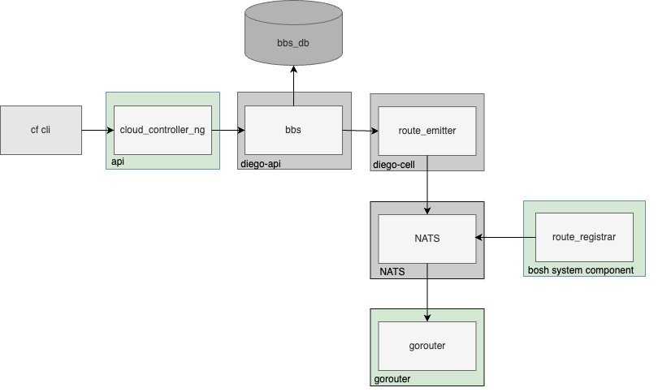

## What are Per-Route Features?
Before this feature was implemented, the Cloud Foundry routing stack did not support configuring features for specific routes. Most features could only be defined at the platform level. The generic per-route features allow for defining specific options on a per-route basis. 

The introduction of the generic per-route features was detailed in [RFC-0027](https://github.com/cloudfoundry/community/blob/main/toc/rfc/rfc-0027-generic-per-route-features.md) and referenced in the [community implementation issue](https://github.com/cloudfoundry/community/issues/909). The implementation became available since routing-release/v0.329.

The first per-route feature implemented is the load balancing algorithm, which defines how the load is distributed between Gorouters and backends. The algorithm can be configured on the route level via the application manifest:
```
applications:
- name: test
  routes:
  - route: example.com
    options:
      loadbalancing: round-robin
  - route: example2.com
    options:
      loadbalancing: least-connection
```

**NOTE**: In the implementation, the `options` property of a route represents per-route features.

## Overview
The picture provides a simplified overview of the participating components. The components marked in green need to be enhanced to support additional per-route features.



Implementing per-route features in Cloud Foundry is a laborious process because it requires changes to multiple components in several working groups, namely Application Platform Runtime and Application Runtime Interface.

## Required Changes

* Create an RFC (or an amendment to the existing one) to communicate a new per-route feature
* Create an implementation issue similar to [tracking issue #909](https://github.com/cloudfoundry/community/issues/909)
* Find your use case and implement

### Use Cases
#### New Feature for Application Routes 
To introduce a new application per-route option, follow the instructions:
* Extend **Cloud Controller** to accept and process a new per-route options in the manifest within [app/messages](https://github.com/sap-contributions/cloud_controller_ng/tree/main/app/messages), especially `route-*-message.rb ` and `manifest_routes_*_message.rb`.
* There is no need to adapt the coding in **BBS**. The `route` object is stored as a generic JSON object in BBS. Therefore, BBS simply accepts the `options` it receives from Cloud Controller and saves them as a string in its database. For more details, refer to the discussion on [BBS issue #939](https://github.com/cloudfoundry/diego-release/issues/939).
* There is no need to change anything in **route-emitter** and **routing-info** components. The initial implementation of per-route features extended the `CFRoute` with `options` as a raw JSON message. The only additional step you might consider is implementing tests for these components to ensure that the new option is included in the raw JSON.
* There is no need to implement anything in **NATS**, as NATS only forwards the route registration messages.
* Implement your logic in **Gorouter** if it does not already exist. Extend the options included in the registration message within the [mbus/subscriber](https://github.com/cloudfoundry/gorouter/blob/b0d88bb6204cf28e476b4ee680a6f5a154885608/mbus/subscriber.go#L1). The structure `RegistryMessageOpts` represents the property `options` of the NATS registration message. This property can contain additional, custom configuration for a route.
* Please do not forget adapt examples and extend the documentation related to your changes.

#### New Feature for Bosh Components
For the bosh system components like concourse or monitoring the route information will be transferred via shorten path. 
* Implement the same change as for the use case above in the **Gorouter**
* Enhance **route-register** [configuration](https://github.com/cloudfoundry/route-registrar/blob/96bc622f89bb0366723086d5a5bf89e3ddfe5a39/config/config.go#L1) with a new property within the `options` structure. Add your implementation to correctly map the Route Options in the [messagebus](https://github.com/cloudfoundry/route-registrar/blob/96bc622f89bb0366723086d5a5bf89e3ddfe5a39/messagebus/messagebus.go#L1). 
* Add a new option to the [specification](https://github.com/cloudfoundry/routing-release/blob/65902515fc73bb7662b3d071c68ddc28a69e391c/jobs/route_registrar/spec#L146) of the route-registrar job in the **routing-release**.


